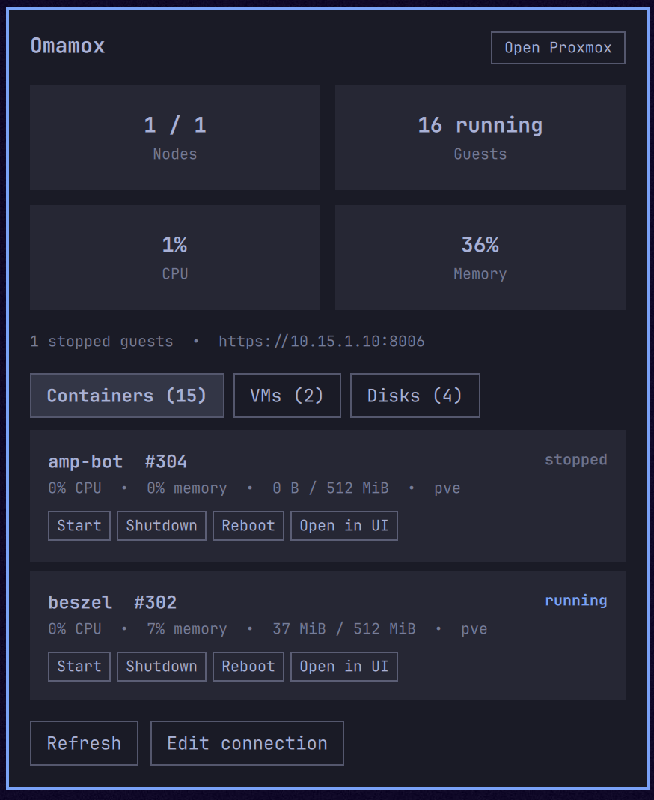

# Omamox - Proxmox management

Proxmox management and status from the Omarchy bar.
Monitor nodes, guests, and storage with quick power controls and web access.



## Install

```bash
omarchy plugin add https://github.com/brandc87/omamox.git --enable
```

Optionally position the widget:

```bash
omarchy bar move io.github.brandc87.omamox --section right
```

## Remove

```bash
omarchy plugin remove io.github.brandc87.omamox
```

## Create the Proxmox API token

The recommended setup uses a dedicated user, a least-privilege role, and a
privilege-separated token. Complete these steps in the Proxmox web interface
as an administrator.

### 1. Create a role

Open **Datacenter → Permissions → Roles**, select **Create**, and name the role
`Omamox`.

| Privilege | Purpose |
| --- | --- |
| `Sys.Audit` | Read node status and utilisation |
| `VM.Audit` | Read VM and container status |
| `Datastore.Audit` | Read storage status and usage |
| `VM.PowerMgmt` | Start, shut down, and reboot guests |

For monitoring only, omit `VM.PowerMgmt`. The dashboard will work, but
Proxmox will reject power actions.

### 2. Create a dedicated user

Open **Datacenter → Permissions → Users**, select **Add**, and create
`omamox@pve`. Do not reuse an administrator account.

### 3. Assign the role to the user

Open **Datacenter → Permissions**, select **Add → User Permission**, and set:

- Path: `/`
- User: `omamox@pve`
- Role: `Omamox`
- Propagate: enabled

Using `/` lets Omamox display all resources covered by the role. For a
restricted setup, assign the role only to the required resource paths.

### 4. Create the API token

Open **Datacenter → Permissions → API Tokens**, select **Add**, and set:

- User: `omamox@pve`
- Token ID: `omamox`
- Privilege Separation: enabled
- Expire: set an appropriate date, or manage rotation manually

Proxmox displays the token secret only once. Copy it immediately and store it
securely. If lost, delete the token and create a replacement.

### 5. Assign the role to the token

Because privilege separation is enabled, the token needs its own ACL. Open
**Datacenter → Permissions**, select **Add → API Token Permission**, and set:

- Path: `/`
- API Token: `omamox@pve!omamox`
- Role: `Omamox`
- Propagate: enabled

Both assignments are required. A privilege-separated token receives the
intersection of its own ACL and its owning user's ACL.

### 6. Build the Omamox API key

Combine the token identifier and secret:

```text
omamox@pve!omamox=TOKEN_SECRET
```

Enter the complete value, including `!` and `=`—not only the secret.

## Connect Omamox

Click the Omamox bar icon and enter:

- URL: normally `https://hostname-or-ip:8006`
- API key: the complete value created above
- Allow insecure TLS: enable only for a self-signed or untrusted certificate

Select **Save and connect**. Omamox stores the connection in
`~/.config/omamox/.env`, with file mode `0600` and directory mode `0700`.

### Manual configuration

```ini
API_KEY=omamox@pve!omamox=TOKEN_SECRET
URL_BASE=https://proxmox.example:8006
ALLOW_INSECURE=false
```

```bash
chmod 700 ~/.config/omamox
chmod 600 ~/.config/omamox/.env
omarchy restart shell
```

## TLS certificates

Certificate verification is enabled by default and strongly recommended.
Install a certificate trusted by the Omarchy machine whenever possible.

For a self-signed certificate, enable **Allow insecure TLS** or set
`ALLOW_INSECURE=true`. This disables certificate and hostname verification
for Omamox API requests; use it only on a trusted network. It does not permit
plain HTTP: API requests and credentials are always sent over HTTPS.

## Usage

- Left-click the icon to open or close the panel.
- Middle-click it to refresh immediately.
- **Open Proxmox** opens the cluster web interface.
- **Containers**, **VMs**, and **Disks** filter the resource list.
- **Start**, **Shutdown**, and **Reboot** control a guest. Shutdown and Reboot require
  confirmation.
- **Open in UI** opens the selected guest in Proxmox.
- **Edit connection** changes the host, token, or TLS setting.

The service refreshes every 30 seconds and whenever the panel opens. Change
the interval in widget settings or run:

```bash
omarchy bar set io.github.brandc87.omamox refreshIntervalSec 60
```

The supported interval is 5–3600 seconds.

## Troubleshooting

### `401 Unauthorized`

- Confirm the API key contains the full token identifier and secret.
- Check that the token has not expired or been deleted.
- Create a replacement if the secret was lost; Proxmox cannot reveal it again.

### `403 Permission check failed`

- Assign `Omamox` to both `omamox@pve` and `omamox@pve!omamox` at the
  intended path.
- Enable **Propagate** when assigning at `/`.
- Add `VM.PowerMgmt` if monitoring works but power actions fail.

### Certificate verification failed

Install a trusted certificate, add the issuing CA to Omarchy, or enable
**Allow insecure TLS** on a trusted private network.

### The panel is empty

- Confirm the Omarchy machine can reach port `8006` on the Proxmox host.
- Include `https://` and the correct port in the URL.
- Confirm the role has `Sys.Audit`, `VM.Audit`, and `Datastore.Audit`.
- Click **Refresh** after correcting permissions.

### Plugin changes do not appear

```bash
omarchy plugin validate ~/.config/omarchy/plugins/io.github.brandc87.omamox
omarchy restart shell
```

## Security notes

- Use a dedicated user and token.
- Grant only the resource paths Omamox needs.
- Omit `VM.PowerMgmt` for a read-only dashboard.
- Set an expiry date and rotate the token periodically.
- Never commit `~/.config/omamox/.env` or paste the token into logs or issues.
- Prefer valid TLS certificates over `ALLOW_INSECURE=true`.

## Architecture

- `Panel.qml` owns the bar button and interface.
- `Service.qml` owns configuration, polling, API actions, timers, and state.
- `Model.js` parses configuration and Proxmox responses.
- `OmamoxIcon.qml` provides the theme-aware icon.

API requests use `Quickshell.Io.Process`; the token is supplied to `curl` over
stdin rather than exposed in process arguments.

## Development

```bash
omarchy plugin validate ~/.config/omarchy/plugins/io.github.brandc87.omamox
```

Upstream documentation:

- [Proxmox VE user management and API tokens](https://pve.proxmox.com/pve-docs/chapter-pveum.html)
- [Proxmox VE API overview](https://pve.proxmox.com/wiki/Proxmox_VE_API)
- [Omarchy plugin development](https://omarchyplugins.com/develop.html)
